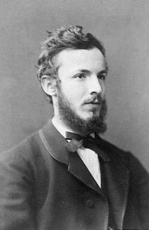

<!-- _class: title-academic -->
<!-- _paginate: skip -->

# Set Theory and Infinity

## A Cantor-Inspired Lecture Deck

---

<!-- _class: toc -->

## Table of Contents

1. Historical context
2. Core definitions
3. Diagonal argument
4. Applications and limits

---

<!-- _class: chapter -->
<!-- _paginate: skip -->

# Chapter 1

## Infinity as a Structured Object

---

<!-- _class: multicolumn callout -->

## Countable vs Uncountable Sets

**Countable examples**
- Natural numbers
- Integers
- Rational numbers

> **Callout:** Not all infinities are equal. The reals cannot be listed in sequence.

**Key result**
- `|R| > |N|`

---

<!-- _class: references -->

## References

- [1] Cantor, G. (1891). On an elementary question of set theory.
- [2] Halmos, P. (1960). Naive Set Theory.
- [3] Enderton, H. (1977). Elements of Set Theory.

---

<!-- _class: end -->
<!-- _paginate: skip -->

# Thank You

## Questions and discussion
