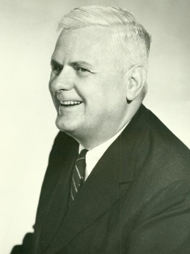

<!-- _class: title-academic -->
<!-- _paginate: skip -->

# Lambda Calculus Essentials

## A Church-Inspired Lecture Deck

---

<!-- _class: toc -->

## Table of Contents

1. Syntax and abstraction
2. Beta reduction
3. Encodings
4. Legacy in programming languages

---

<!-- _class: chapter -->
<!-- _paginate: skip -->

# Chapter 1

## Programs as Mathematical Objects

---

<!-- _class: multicolumn callout -->

## Functional Core Ideas

**Core operators**
- Abstraction: `\x.M`
- Application: `(M N)`
- Variable binding and scope

> **Callout:** Computation emerges from substitution rules, not machine instructions.

**Practical link**
- Foundations for functional languages and type theory

---

<!-- _class: references -->

## References

- [1] Church, A. (1936). An unsolvable problem of elementary number theory.
- [2] Barendregt, H. (1984). The Lambda Calculus.
- [3] Pierce, B. (2002). Types and Programming Languages.

---

<!-- _class: end -->
<!-- _paginate: skip -->

# Thank You

## Questions and discussion
