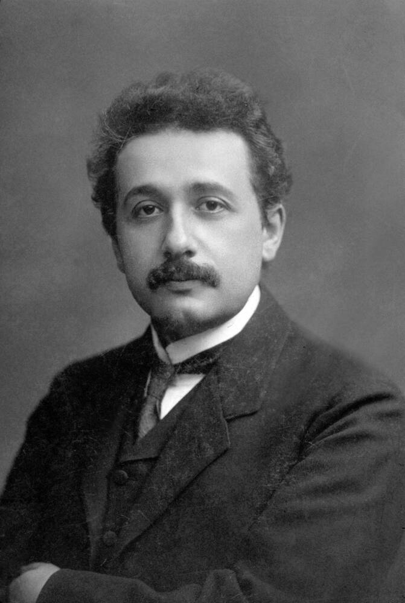

<!-- _class: title-academic -->
<!-- _paginate: skip -->

# Relativity in Context

## An Einstein-Inspired Lecture Deck

---

<!-- _class: toc -->

## Table of Contents

1. Problems in classical mechanics
2. Special relativity
3. General relativity
4. Modern implications

---

<!-- _class: chapter -->
<!-- _paginate: skip -->

# Chapter 1

## Space, Time, and Frames of Reference

---

<!-- _class: multicolumn callout -->

## The Relativity Shift

**Key principles**
- Constant speed of light
- Invariance of physical laws
- Geometry tied to gravity

> **Callout:** Measurements depend on reference frames, but laws remain coherent.

**Practical outcomes**
- GPS corrections
- Gravitational lensing predictions

---

<!-- _class: references -->

## References

- [1] Einstein, A. (1905). On the electrodynamics of moving bodies.
- [2] Einstein, A. (1916). The foundation of general relativity.
- [3] Schutz, B. (2009). A First Course in General Relativity.

---

<!-- _class: end -->
<!-- _paginate: skip -->

# Thank You

## Questions and discussion
