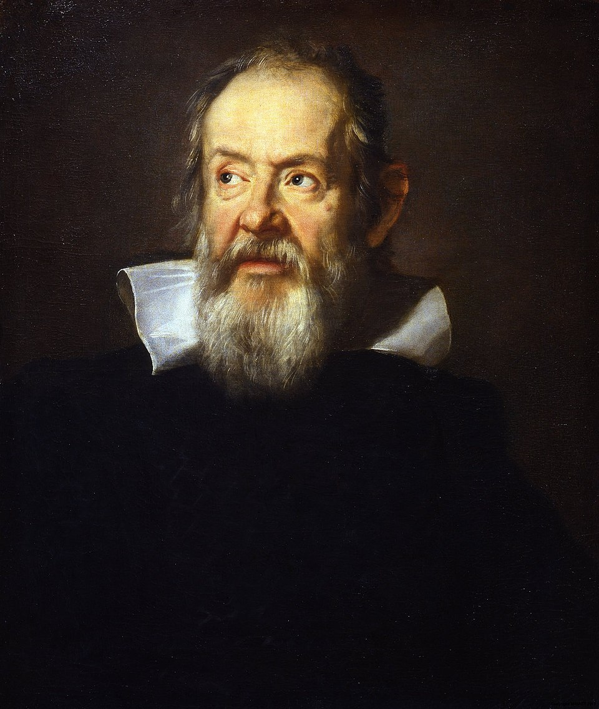

<!-- _class: title-academic -->
<!-- _paginate: skip -->

# Observation Changes Theory

## A Galileo-Inspired Lecture Deck

---

<!-- _class: toc -->

## Table of Contents

1. Instrumentation
2. Motion experiments
3. Evidence and authority
4. Lasting influence

---

<!-- _class: chapter -->
<!-- _paginate: skip -->

# Chapter 1

## Measuring What Was Assumed

---

<!-- _class: multicolumn callout -->

## Experimental Method in Practice

**Method shifts**
- Repeatable observation
- Quantified outcomes
- Publicly testable claims

> **Callout:** Better instruments do not just add data; they can change theory.

**Signature domain**
- Kinematics and inertial reasoning

---

<!-- _class: references -->

## References

- [1] Galileo, G. (1638). Discourses and Mathematical Demonstrations.
- [2] Drake, S. (1978). Galileo at Work.
- [3] Wootton, D. (2010). Galileo: Watcher of the Skies.

---

<!-- _class: end -->
<!-- _paginate: skip -->

# Thank You

## Questions and discussion
