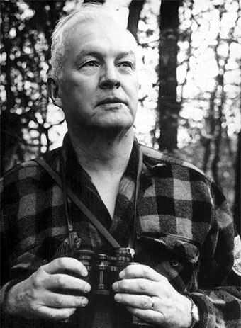

<!-- _class: title-academic -->
<!-- _paginate: skip -->

# Functional Programming Concepts

## A Haskell-Inspired Lecture Deck

---

<!-- _class: toc -->

## Table of Contents

1. Type systems
2. Purity and effects
3. Compositional design
4. Industrial applications

---

<!-- _class: chapter -->
<!-- _paginate: skip -->

# Chapter 1

## Thinking in Functions, Not Procedures

---

<!-- _class: multicolumn callout -->

## Why Types Matter

**Core strengths**
- Strong static typing
- Referential transparency
- Declarative composition

> **Callout:** Type signatures can serve as design contracts and executable documentation.

**Adoption patterns**
- Finance, compilers, correctness-critical systems

---

<!-- _class: references -->

## References

- [1] Hudak, P. et al. (2007). A History of Haskell.
- [2] Bird, R. (2014). Thinking Functionally with Haskell.
- [3] Lipovaca, M. (2011). Learn You a Haskell.

---

<!-- _class: end -->
<!-- _paginate: skip -->

# Thank You

## Questions and discussion
