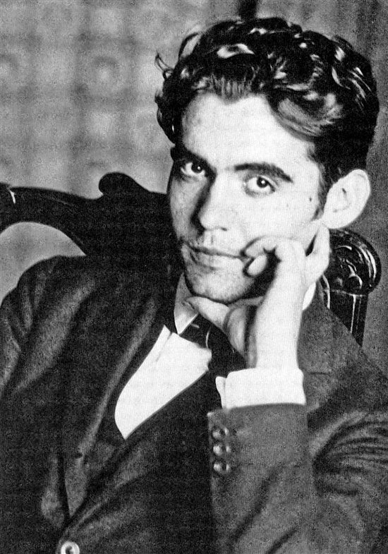

<!-- _class: title-academic -->
<!-- _paginate: skip -->

# Symbol, Rhythm, and Voice

## A Lorca-Inspired Lecture Deck

---

<!-- _class: toc -->

## Table of Contents

1. Historical context
2. Motifs and metaphor
3. Performance and language
4. Legacy and reception

---

<!-- _class: chapter -->
<!-- _paginate: skip -->

# Chapter 1

## Poetic Form as Living Memory

---

<!-- _class: multicolumn callout -->

## Reading Lorca in Practice

**Recurring motifs**
- Moon and night imagery
- Tension between freedom and fate
- Musicality and repetition

> **Callout:** Poetic structure carries argument even before literal interpretation begins.

**Discussion prompt**
- How does performance context alter interpretation?

---

<!-- _class: references -->

## References

- [1] Lorca, F. G. (1931). Poema del cante jondo.
- [2] Gibson, I. (1989). Federico Garcia Lorca: A Life.
- [3] Anderson, A. (1994). Lorca's Late Poetry.

---

<!-- _class: end -->
<!-- _paginate: skip -->

# Thank You

## Questions and discussion
