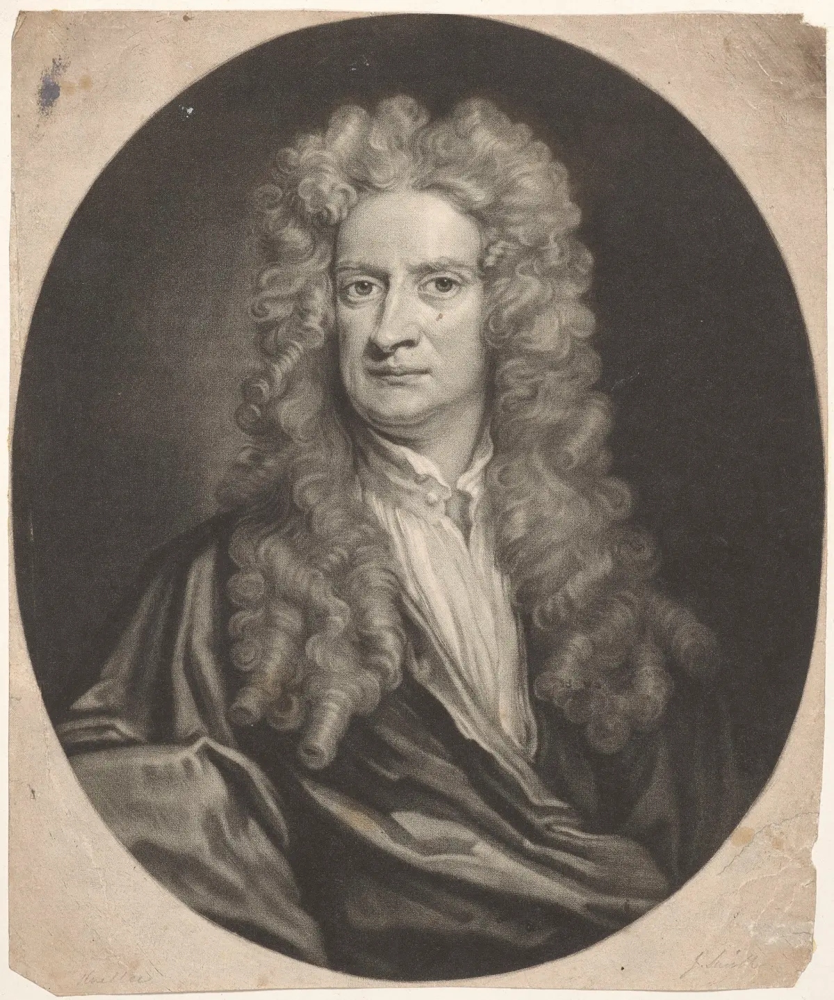

<!-- _class: title-academic -->
<!-- _paginate: skip -->

# Motion, Force, and Prediction

## A Newton-Inspired Lecture Deck

---

<!-- _class: toc -->

## Table of Contents

1. Laws of motion
2. Universal gravitation
3. Mathematical formalism
4. Engineering applications

---

<!-- _class: chapter -->
<!-- _paginate: skip -->

# Chapter 1

## Turning Observation into Equations

---

<!-- _class: multicolumn callout -->

## Core Mechanics Framework

**Foundational laws**
- Inertia
- Force equals mass times acceleration
- Action and reaction symmetry

> **Callout:** Compact laws can explain broad classes of physical behavior.

**Applied range**
- Orbital dynamics
- Mechanical system design

---

<!-- _class: references -->

## References

- [1] Newton, I. (1687). Principia Mathematica.
- [2] Cohen, I. B. (1999). The Principia.
- [3] Westfall, R. (1980). Never at Rest.

---

<!-- _class: end -->
<!-- _paginate: skip -->

# Thank You

## Questions and discussion
