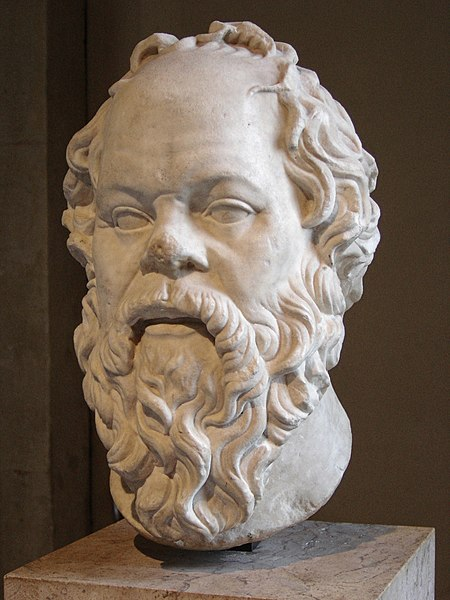

<!-- _class: title-academic -->
<!-- _paginate: skip -->

# Method Through Questions

## A Socrates-Inspired Lecture Deck

---

<!-- _class: toc -->

## Table of Contents

1. Socratic method basics
2. Elenchus in practice
3. Ethics and civic reasoning
4. Educational applications

---

<!-- _class: chapter -->
<!-- _paginate: skip -->

# Chapter 1

## Inquiry Before Assertion

---

<!-- _class: multicolumn callout -->

## Structuring a Socratic Dialogue

**Dialogue loop**
- Clarify definitions
- Probe assumptions
- Surface contradictions

> **Callout:** Good questions can reveal weak premises faster than long explanations.

**Learning outcome**
- Stronger reasoning and self-correction habits

---

<!-- _class: references -->

## References

- [1] Plato. Apology.
- [2] Plato. Meno.
- [3] Vlastos, G. (1991). Socrates, Ironist and Moral Philosopher.

---

<!-- _class: end -->
<!-- _paginate: skip -->

# Thank You

## Questions and discussion
