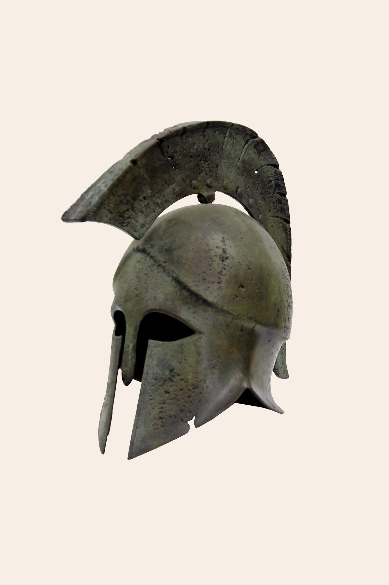

<!-- _class: title-academic -->
<!-- _paginate: skip -->

# Institutions and Discipline

## A Sparta-Inspired Lecture Deck

---

<!-- _class: toc -->

## Table of Contents

1. Civic structure
2. Military organization
3. Trade-offs and constraints
4. Lessons for modern teams

---

<!-- _class: chapter -->
<!-- _paginate: skip -->

# Chapter 1

## Collective Design and Individual Role

---

<!-- _class: multicolumn callout -->

## Strategic Coordination

**System characteristics**
- Clear role assignment
- Strict training cadence
- Emphasis on resilience

> **Callout:** Strong systems increase reliability but can reduce adaptability.

**Modern analogy**
- High-discipline operational teams under critical constraints

---

<!-- _class: references -->

## References

- [1] Xenophon. Constitution of the Lacedaemonians.
- [2] Cartledge, P. (2003). The Spartans.
- [3] Hodkinson, S. (2000). Property and Wealth in Classical Sparta.

---

<!-- _class: end -->
<!-- _paginate: skip -->

# Thank You

## Questions and discussion
